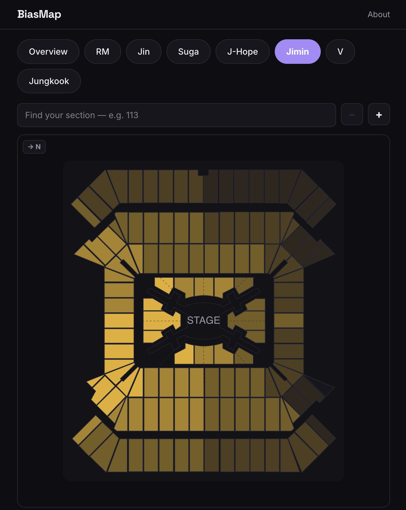
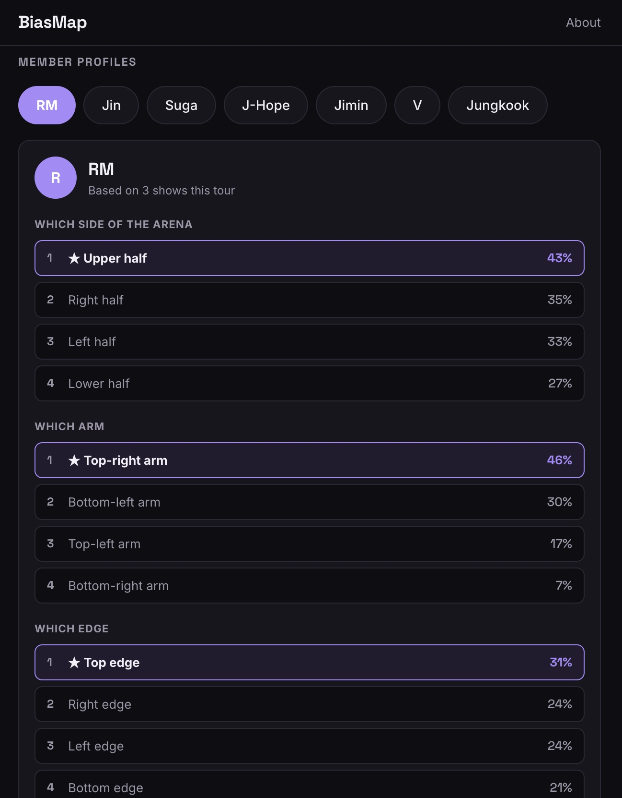

# BiasMap

**Know your seat before the lights go down.**

BiasMap is a fan tool for concert-goers that turns scattered tour intel — setlists, member stage
movement, and seat reports — into a per-venue guide you can check before buying a ticket or walking
into the arena. Live build for the BTS ARIRANG World Tour (North American leg).

🔗 [Live app](https://biasmap.app/)· Built with Next.js 16 (App Router), TypeScript, Supabase (Postgres), and Tailwind CSS.

## Highlights

### 🎯 Seat-section heatmap


An interactive SVG venue chart (`components/SeatMap.tsx`) that colors every section by how much stage
time a chosen member actually spent facing it. Not a static overlay — the heat values come from a
hand-built data pipeline:

- Position data is hand-logged from full-show VODs (`member`, `zone`, `timestamp`) into Postgres, since
  no fixed-camera fancam feed exists for this tour.
- A SQL view (`member_section_heat`) aggregates raw logs into ranked, weighted-minutes-per-section
  stats per member, per venue.
- The frontend does **tie-aware ranking** — Postgres `rank()` lets multiple sections share a rank, and
  the UI deliberately never splits a tied group when showing "best sections," even at the cutoff
  boundary.
- Sections are colored with a 5-bucket heat scale (hottest → coldest), with pan/zoom, section search,
  and a per-member "best seat" callout.
- Chart rotation is decoupled from the underlying section geometry: a per-venue `north_angle_deg`
  rotates only the compass overlay, never the authored section polygons — so orientation fixes can
  never silently corrupt the seat data itself.
- Handles real-world scale: some venues produce 1000+ heat rows, which exceeds a single Postgres REST
  page, so the client transparently paginates to avoid silently dropping data.

### 🪪 Tour profile card


For shows that haven't happened yet (no VOD to log positions from), `components/TourProfileCard.tsx`
answers a narrower but still useful question: *based on this member's pattern across the tour so far,
which side/arm/edge of the stage do they favor?* Three independently-ranked categories (half / arm /
edge) are kept separate rather than merged into one score, because their percentages aren't
comparable — a deliberate modeling choice, not an oversight. This lets the app show *something* useful
for upcoming shows instead of an empty state.

### Also included
- **Show guide** — setlist (with tie-aware surprise-song history), venue facts, confidence-scored fan
  intel, all per show/night.
- **Calendar / home** — tour switcher, live countdowns, grouped multi-night venue listings.
- **Fan reports** — post-show section reports submitted through the site, feeding future intel.

## Stack

| Layer      | Choice                                   |
|------------|-------------------------------------------|
| Framework  | Next.js 16 (App Router), TypeScript        |
| Styling    | Tailwind CSS v4, CSS variables (dark theme)|
| Data       | Supabase (Postgres), row-level security    |
| Hosting    | Vercel + Vercel Analytics                  |

## Getting started

```bash
npm install
npm run dev
```

Open [http://localhost:3000](http://localhost:3000). You'll need a `.env.local` with Supabase
credentials (`NEXT_PUBLIC_SUPABASE_URL`, `NEXT_PUBLIC_SUPABASE_ANON_KEY`) to load real data.

## Project layout

```
app/                  Routes: calendar (/), show guide (/show/[slug]), reports (/report/[slug]), about
components/           SeatMap, TourProfileCard, SetlistSection, SectorCompass, etc.
lib/                  Supabase client + shared types
supabase/sql/         Views and functions backing the heatmap and profile pipelines
```

## Disclaimer

BiasMap is an independent fan project, not affiliated with or endorsed by any artist, label, or tour
operator.
